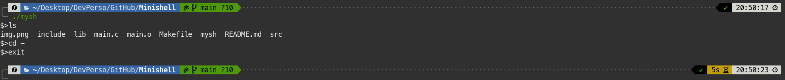

# Minishell project :desktop_computer:

## Done by Melissa - Epitech 2022 :mortar_board:

This project is a part of the **first** year of Epitech. <br>
We had **2 weeks** to complete it. :spiral_calendar: <br>

The goal of this project is to recreate a tcsh shell. <br>

To try this program, you need to use this **command**: <br>

```bash
make && ./mysh && make fclean
```

An output you can get from this program can be:



Here are the different **tools** and **languages** we used to make this project: :hammer_and_wrench:

[](https://github.com/tandpfun/skill-icons)